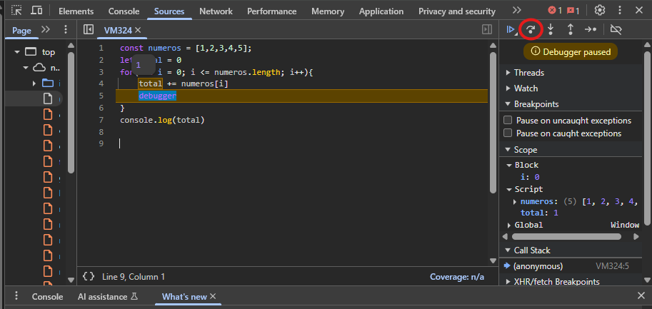
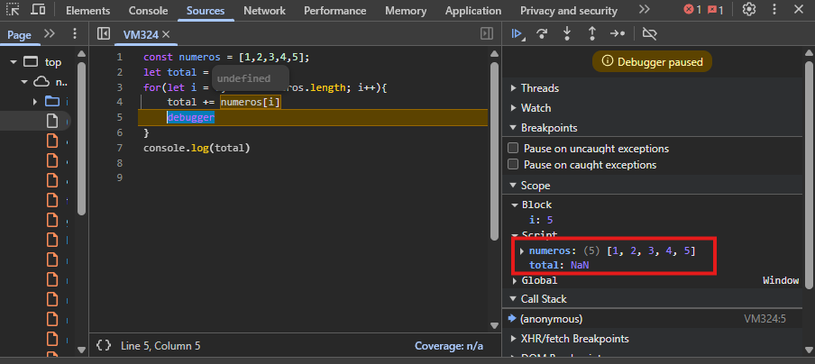
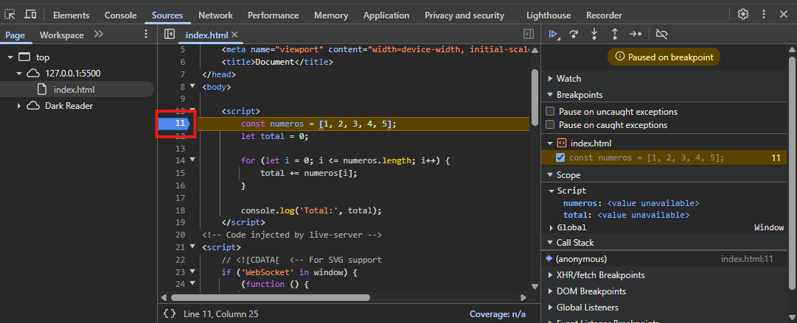

Los debuggers nos ayudan a detener nuestro código en un fragmento y, a partir de ahí, ejecutar línea por línea para saber qué es lo que está pasando dentro.

### Pero, ¿cómo podemos debuggear?
Existen 3 formas de hacerlo (o al menos son las que yo conozco), pero solo veremos 2 (porque son las que más utilizo y las que se me hacen más fáciles, ya que no requieren configuración).

**Primer método:** palabra reservada `debugger`. Vamos a verlo con un ejemplo en código:

```javascript
// Ejemplo: queremos sumar todos los números de un arreglo
const numeros = [1, 2, 3, 4, 5];
let total = 0;

for (let i = 0; i <= numeros.length; i++) {
    total += numeros[i]; // Aquí hay un error 👀
    debugger; // El programa se detendrá aquí en cada iteración
}

console.log('Total:', total);
```

Para que se ejecute el debugger debemos tener abierto el inspector del navegador. En cuanto se detecte, el código se detendrá y a partir de ahí podrás ir observando el comportamiento.
Puedes escribir el código de ejemplo en la consola del navegador para ver su funcionamiento.

En la imagen anterior se muestra la ejecución. Puedes posicionar el cursor sobre las variables para ir observando el valor. Aquí lo estoy colocando sobre la variable total dentro del for, y obtenemos el valor de 1 porque es la primera iteración.

Para continuar con el flujo, damos click en el botón que está encerrado en el círculo rojo. Si quisieras detener la ejecución, solo da click en el botón que está a su lado izquierdo.

Y como no voy a agregar una imagen por cada iteración, vamos a saltarnos a la última.
Al observar, vemos que al poner el cursor sobre numeros[i] nos da undefined. Es más que obvio, ya que estamos intentando acceder al 6to elemento del arreglo y este solamente tiene 5.
En el lado derecho, en el cuadro rojo, la variable total se volvió NaN porque no podemos sumarle un undefined a un número.

**Segundo método:** agregar un breakpoint en el archivo desde la pestaña Sources.

En el apartado Sources buscamos nuestro archivo (en este caso es el index.html) y en la línea donde queremos parar la ejecución agregamos el breakpoint.
A partir de ahí, la ejecución del código se detendrá como con el debugger. Puedes agregar tantos breakpoints como desees.

Sé que este ejemplo es muy básico y quizá no muestra lo poderosos que pueden llegar a ser los debuggers, pero en la práctica, cuando estés atorado, te van a salvar mucho más rápido que un console.log.

En ocasiones me ha pasado que mi desarrollo no funciona como espero en el comportamiento de un método. Cuando empiezo a debuggear me doy cuenta de que solo había creado el método, pero no lo estaba llamando. Suena tonto, pero este tipo de cosas suele pasar seguido, y debuggear te puede ahorrar horas.